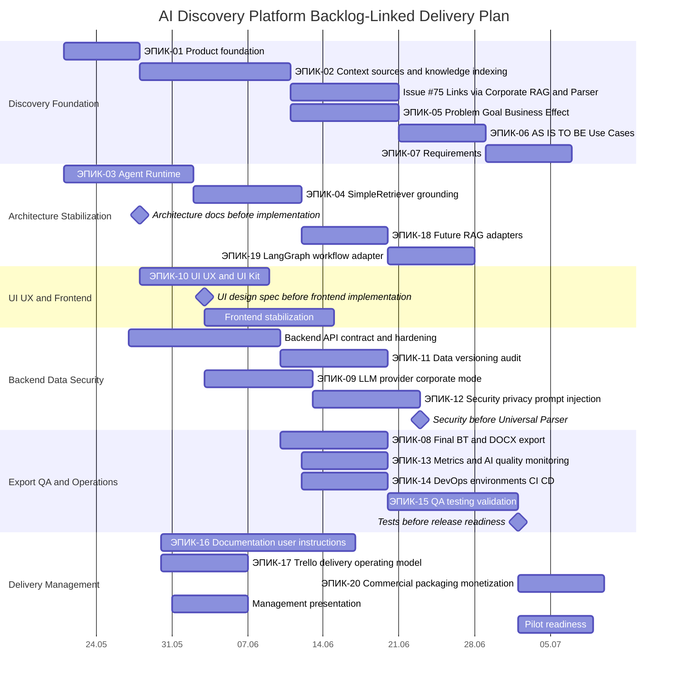
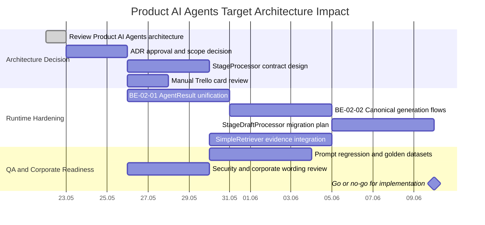

# Gantt delivery plan

Статус: draft. План ориентировочный на 6-8 недель, начиная с 2026-05-21. Mermaid Gantt ниже не означает подключение к внешнему инструменту.

```mermaid
gantt
    title AI Discovery Platform Delivery Plan
    dateFormat YYYY-MM-DD
    axisFormat %d.%m

    section Delivery Governance
    Стабилизация MVP                         :active, mvp, 2026-05-21, 10d
    Оформление global Codex agents           :agents, 2026-05-21, 7d
    Agent operating model                    :model, after agents, 5d
    Trello operating model                   :trello, 2026-05-25, 5d
    Gantt/reporting                          :gantt, after trello, 5d

    section Product Runtime
    Backend stabilization                    :backend, 2026-05-28, 14d
    Database/audit                           :db, 2026-06-01, 10d
    LLM/RAG settings                         :llm, 2026-06-04, 10d
    Security review                          :security, after llm, 7d

    section Frontend and Quality
    Frontend stabilization                   :frontend, 2026-06-03, 14d
    QA automation                            :qaauto, 2026-06-10, 14d
    DOCX/export                              :docx, 2026-06-12, 8d
    Release readiness                        :release, 2026-06-24, 7d
```

## Правила обновления

- Если меняются сроки, dependencies или release scope, обновляет `ai-delivery-project-manager`.
- Если меняется Trello/backlog scope, `ai-trello-analyst` синхронизирует Markdown package.
- Если план используется только как Mermaid-файл, нельзя утверждать, что он подключен к внешнему Gantt-инструменту.

## Delivery notes

- `BE-01-01` относится к блоку `Backend stabilization`; даты Gantt не изменялись, так как задача фиксирует текущий API contract без изменения сроков.

## Gantt v2: backlog-linked delivery plan

Статус: draft. План связывает 20 эпиков из `docs/backlog/trello-cards.md`, Issue #75 и руководительские артефакты. Даты ориентировочные и не являются внешним обязательством.



## Dependencies v2

- Architecture docs before implementation.
- Security before Universal Parser.
- Context/RAG before Problem/Goal grounding.
- UI design spec before frontend implementation.
- Tests before release readiness.
- Issue #75 зависит от context/RAG design, security controls и frontend Context screen spec.

## Product AI Agents architecture decision impact

Статус: draft. Этот блок отражает архитектурный impact review Product AI Agents от 2026-05-22. Mermaid Gantt ниже не означает подключение к внешнему Gantt-инструменту и не меняет автоматически сроки существующих задач.

Связанные документы:

- `docs/architecture/product-ai-agents-architecture-review.md`;
- `docs/architecture/product-ai-agents-target-architecture.md`;
- `docs/architecture/ADR-002-product-ai-agents-target-architecture.md`;
- `docs/backlog/product-ai-agents-architecture-decision-backlog.md`.



Delivery impact:

- Если ADR отклонён, блок остаётся decision record и не создаёт implementation scope.
- Если ADR принят, `ARCH-PA-01`, `BE-02-05`, `BE-02-06` и `QA-PA-01` нужно включить в активный backlog.
- Trello API не вызывался; создан только manual import package в Markdown.
