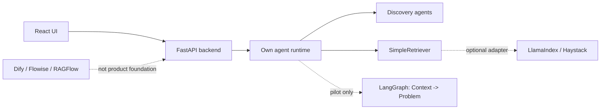

# ADR-001: Выбор open-source AI/RAG/agent framework для AI Discovery Platform

Дата: 2026-05-14

Статус: принято

## Контекст

AI Discovery Platform сейчас состоит из собственного React UI и FastAPI backend. Backend содержит собственный `AgentOrchestrator`, который связывает типы discovery-артефактов с доменными агентами: `ContextIngestionAgent`, `ProblemAgent`, `GoalAgent`, `BusinessEffectAgent`, `UseCaseAgent`, `RequirementsAgent`, `CriticAgent`.

Платформа должна развиваться в сторону корпоративного контура: локальный или изолированный запуск, контролируемые LLM-клиенты, трассируемость источников, проверяемые артефакты, аудит изменений, возможность будущей монетизации. Поэтому нельзя выбирать framework только по скорости прототипирования. Важны архитектурный контроль, лицензия, возможность использовать framework как внутреннюю библиотеку, а не как замену продукта.

Лицензии ниже являются предварительной инженерной оценкой по публичным источникам на дату ADR. Перед добавлением зависимости в `requirements.txt`, `package.json`, Docker image или поставку клиенту требуется отдельная проверка лицензии, transitive dependencies и условий cloud/enterprise edition.

## Критерии

- Сохранить существующий React UI и FastAPI backend.
- Использовать внешние open-source решения только как внутренние библиотеки или адаптеры.
- Не принимать GPL, AGPL, SSPL, Commons Clause, non-commercial и source-available лицензии с ограничениями без отдельного ADR и юридической проверки.
- Не строить основной продукт на low-code платформе, если она заменяет доменную модель AI Discovery Platform.
- Сначала стабилизировать собственный agent runtime, затем добавлять RAG и workflow adapters.

## Целевая схема

## Сравнение вариантов

### 1. Текущий самописный `AgentOrchestrator`

- Назначение: внутренний runtime/registry, который выбирает агента по `artifact_type` и передаёт ему LLM-клиент.
- Подходит ли для AI Discovery Platform: да, потому что уже отражает доменную модель discovery-этапов и не тянет чужую платформенную модель.
- Можно ли использовать как библиотеку: не внешняя библиотека, но можно оформить как внутренний пакет backend.
- Можно ли использовать как основу платформы: да, при условии доработки до полноценного runtime.
- Риски для корпоративного контура: сейчас не хватает явного workflow state, retries, tracing, audit log, policy gates, versioned prompts, retrieval boundary и наблюдаемости.
- Риски для монетизации: низкий лицензионный риск, но высокий риск технического долга, если runtime останется набором ручных вызовов.
- Предварительная оценка лицензии: собственный код проекта; внешних license obligations от runtime нет, но нужна явная лицензия репозитория перед коммерческой поставкой.
- Рекомендация: использовать. Это базовый вариант, который нужно привести в порядок первым.

### 2. LangGraph

- Назначение: low-level orchestration framework для stateful, long-running agents и workflow graphs.
- Подходит ли для AI Discovery Platform: частично. Хорошо подходит для явного workflow `Context -> Problem`, human-in-the-loop и контролируемых переходов, но избыточен как немедленная замена всех агентов.
- Можно ли использовать как библиотеку: да, Python package можно встроить в backend.
- Можно ли использовать как основу платформы: нет на текущем этапе. Он должен быть workflow adapter, а не ядро продукта.
- Риски для корпоративного контура: усложнение runtime, зависимость от экосистемы LangChain/LangSmith, необходимость явно отделять open-source library от managed/deployment продуктов.
- Риски для монетизации: MIT для библиотеки выглядит допустимо, но коммерческие/managed компоненты LangChain ecosystem нужно оценивать отдельно.
- Предварительная оценка лицензии: MIT для `langgraph`.
- Рекомендация: использовать позже. Пилотировать только для workflow `Context -> Problem` после стабилизации собственного runtime.

### 3. LlamaIndex

- Назначение: framework для ingestion, indexing, retrievers, query engines, RAG и agentic applications.
- Подходит ли для AI Discovery Platform: да, как RAG/retrieval adapter для документов, источников контекста и цитирования; не должен владеть всей архитектурой discovery-агентов.
- Можно ли использовать как библиотеку: да.
- Можно ли использовать как основу платформы: нет. Он решает RAG-задачи, но не заменяет продуктовую модель discovery stages.
- Риски для корпоративного контура: много интеграций и transitive dependencies; нужно ограничить набор connectors, запретить неутверждённые внешние SaaS и явно контролировать хранение данных.
- Риски для монетизации: MIT выглядит совместимой, но cloud-сервисы, parsers и отдельные integrations требуют отдельной проверки.
- Предварительная оценка лицензии: MIT.
- Рекомендация: использовать позже. Добавлять после `SimpleRetriever` как optional adapter.

### 4. Haystack

- Назначение: Python framework для production-ready RAG, pipelines, retrievers, routers, generators и agent workflows.
- Подходит ли для AI Discovery Platform: да, как более строгий pipeline/RAG adapter, особенно если понадобится прозрачная цепочка retrieval -> rerank -> generation.
- Можно ли использовать как библиотеку: да.
- Можно ли использовать как основу платформы: нет сейчас. Он может стать RAG pipeline layer, но не должен диктовать UI, API и доменную модель.
- Риски для корпоративного контура: потребуется governance вокруг document stores, model providers, telemetry и connectors; возможна более тяжёлая интеграция, чем у простого in-house retriever.
- Риски для монетизации: Apache-2.0 обычно подходит для коммерческого использования, но enterprise/cloud offerings и transitive dependencies проверяются отдельно.
- Предварительная оценка лицензии: Apache-2.0.
- Рекомендация: использовать позже. Рассматривать как альтернативу или дополнение к LlamaIndex adapter после появления стабильного retrieval interface.

### 5. CrewAI

- Назначение: framework для multi-agent automation, crews, role-based agents и event-driven flows.
- Подходит ли для AI Discovery Platform: ограниченно. Концепция crews может быть полезна для экспериментов, но текущие агенты платформы являются детерминированными этапами бизнес-анализа, а не автономной командой role-playing agents.
- Можно ли использовать как библиотеку: да.
- Можно ли использовать как основу платформы: нет. Это изменит стиль orchestration и может размыть контроль над доменной логикой.
- Риски для корпоративного контура: автономные agents/tools требуют строгих allowlists, sandboxing и audit; лишняя сложность для текущего MVP.
- Риски для монетизации: MIT выглядит допустимо, но enterprise/cloud suite и дополнительные tools проверяются отдельно.
- Предварительная оценка лицензии: MIT для основного repo.
- Рекомендация: не использовать. Вернуться к оценке только при появлении сценария с автономными agent teams.

### 6. AutoGen

- Назначение: Microsoft framework для multi-agent AI applications, AgentChat/Core APIs и developer tooling.
- Подходит ли для AI Discovery Platform: нет для нового ядра. На публичной странице проекта указано maintenance mode и рекомендация новым пользователям переходить на Microsoft Agent Framework.
- Можно ли использовать как библиотеку: технически да, но это нежелательно для новой платформенной зависимости.
- Можно ли использовать как основу платформы: нет.
- Риски для корпоративного контура: maintenance mode, миграционный риск, возможная смена архитектурного направления, отдельные риски tools/code execution/MCP.
- Риски для монетизации: код под MIT, документация под CC-BY-4.0, но долгосрочная поддержка и миграция создают продуктовый риск.
- Предварительная оценка лицензии: MIT для code, CC-BY-4.0 для docs/content.
- Рекомендация: не использовать.

### 7. Dify

- Назначение: production-ready platform для agentic workflow development, RAG pipeline, app builder и model management.
- Подходит ли для AI Discovery Platform: нет как foundation. Dify конкурирует с платформенным слоем AI Discovery Platform и будет навязывать собственные UI/workspace/app abstractions.
- Можно ли использовать как библиотеку: нет практически; это полноценная платформа/сервис, а не узкая Python library.
- Можно ли использовать как основу платформы: нет.
- Риски для корпоративного контура: сложная multi-service поставка, своя модель пользователей/workspaces, plugins, runtime и UI; повышенная поверхность безопасности.
- Риски для монетизации: высокий лицензионный риск из-за modified Apache-2.0 с дополнительными условиями, включая multi-tenant restrictions и ограничения вокруг frontend logo/copyright.
- Предварительная оценка лицензии: Dify Open Source License, modified Apache-2.0 with additional conditions; считать рискованной до юридического решения.
- Рекомендация: не использовать. Можно изучать UX/RAG идеи без копирования архитектуры и кода.

### 8. Flowise

- Назначение: visual low-code/no-code builder для AI agents, chatflows, RAG и LangChain-based workflows.
- Подходит ли для AI Discovery Platform: нет как foundation. Flowise закрывает другую задачу: визуальную сборку generic LLM flows, а не доменный discovery lifecycle.
- Можно ли использовать как библиотеку: нет практически; это Node/TypeScript application/platform.
- Можно ли использовать как основу платформы: нет.
- Риски для корпоративного контура: visual execution graph, custom nodes, секреты, tool execution и plugin surface требуют отдельного security model; также это другой frontend/backend stack.
- Риски для монетизации: core доступен под Apache-2.0, но license file выделяет enterprise directory и отдельные commercial-license части; нужно проверять границы использования.
- Предварительная оценка лицензии: Apache-2.0 для core вне enterprise/commercial directories; mixed licensing требует проверки.
- Рекомендация: не использовать.

### 9. RAGFlow

- Назначение: full RAG engine/platform с document understanding, chunking, retrieval, citations, agent capabilities, UI/API и self-hosting через Docker.
- Подходит ли для AI Discovery Platform: частично как reference для RAG quality, но не как foundation продукта.
- Можно ли использовать как библиотеку: ограниченно. Основной delivery model похож на платформу/сервис; есть SDK/API, но не компактный backend adapter уровня `SimpleRetriever`.
- Можно ли использовать как основу платформы: нет.
- Риски для корпоративного контура: тяжёлая инфраструктура, Docker services, storage/search components, sandbox/code executor options, отдельное администрирование и безопасность.
- Риски для монетизации: Apache-2.0 выглядит допустимо, но bundled components, Docker images, models/parsers и cloud edition требуют отдельной проверки.
- Предварительная оценка лицензии: Apache-2.0 для repo.
- Рекомендация: не использовать сейчас. Можно позже сравнить качество ingestion/retrieval как benchmark, но не включать в продукт без отдельного ADR.

## Решение

1. Сохранить собственный React UI.
2. Сохранить собственный FastAPI backend.
3. Не строить продукт целиком на Dify, Flowise или RAGFlow.
4. Использовать open-source решения только как внутренние библиотеки или optional adapters.
5. Сначала привести в порядок собственный agent runtime.
6. Затем добавить `SimpleRetriever` как минимальный внутренний retrieval layer.
7. Затем опционально добавить LlamaIndex/Haystack adapter за стабильным внутренним интерфейсом.
8. Затем опционально добавить LangGraph только для workflow `Context -> Problem`, если собственный runtime уже имеет state, trace и rollback boundaries.

## Что нельзя делать сейчас

- Не подключать сразу LangGraph, LlamaIndex и Haystack.
- Не переписывать всех агентов.
- Не заменять платформу готовым low-code решением.
- Не добавлять зависимости с рискованной лицензией без отдельного решения.

## План внедрения

### Этап 1. Упорядочить собственный agent runtime

- Выделить явные интерфейсы `Agent`, `AgentRuntime`, `AgentResult`, `AgentContext`.
- Сделать единый contract для входов/выходов агентов и structured artifacts.
- Добавить trace id, source artifact versions, prompt version, LLM provider/model metadata.
- Зафиксировать retry/error policy и human-readable ошибки.
- Оставить текущие агенты на месте, не переписывая их поведение массово.

### Этап 2. Добавить `SimpleRetriever`

- Ввести внутренний интерфейс `Retriever` без внешних RAG dependencies.
- Использовать уже извлечённый текст из context sources, chunks и metadata.
- Вернуть top-k chunks с source trace для `ContextIngestionAgent` и `ProblemAgent`.
- Сохранить возможность полностью отключить retrieval в корпоративном контуре.

### Этап 3. Подготовить adapter boundary

- Добавить `RetrieverProvider`/`RagAdapter` interface, не привязанный к конкретному framework.
- Зафиксировать license gate: новая dependency добавляется только после отдельного решения.
- Сделать PoC LlamaIndex или Haystack adapter на отдельной ветке без изменения UI.
- Сравнить качество retrieval, latency, explainability, transitive dependencies и deployment complexity.

### Этап 4. Пилот LangGraph для `Context -> Problem`

- Смоделировать только один workflow: context readiness, problem generation, clarification questions, user answers, problem update.
- Не переносить Goal, BusinessEffect, UseCases, Requirements и CriticAgent до успешной оценки.
- Проверить state persistence, rollback, observability и возможность отключения adapter.

### Этап 5. Governance перед поставкой

- Вести список разрешённых AI/RAG dependencies и запрещённых лицензий.
- Проверять SBOM/transitive licenses перед релизом.
- Разделять open-source library usage и managed/cloud products.
- Документировать, какие данные уходят в LLM, retriever, vector store и telemetry.

## Источники

- LangGraph: [GitHub repo](https://github.com/langchain-ai/langgraph) and [MIT license](https://github.com/langchain-ai/langgraph/blob/main/LICENSE), `langchain-ai/langgraph`.
- LlamaIndex: [GitHub repo](https://github.com/run-llama/llama_index) and [MIT license](https://github.com/run-llama/llama_index/blob/main/LICENSE), `run-llama/llama_index`.
- Haystack: [GitHub repo](https://github.com/deepset-ai/haystack) and [Apache-2.0 license](https://github.com/deepset-ai/haystack/blob/main/LICENSE), `deepset-ai/haystack`.
- CrewAI: [GitHub repo](https://github.com/crewAIInc/crewAI) and [license](https://github.com/crewAIInc/crewAI/blob/main/LICENSE), `crewAIInc/crewAI`.
- AutoGen: [GitHub repo legal notices and maintenance-mode notice](https://github.com/microsoft/autogen) and [MIT code license](https://github.com/microsoft/autogen/blob/main/LICENSE-CODE), `microsoft/autogen`.
- Dify: [GitHub LICENSE](https://github.com/langgenius/dify/blob/main/LICENSE), modified Apache-2.0 with additional conditions, `langgenius/dify`.
- Flowise: [GitHub LICENSE.md](https://github.com/FlowiseAI/Flowise/blob/main/LICENSE.md), Apache-2.0 core with commercial-license enterprise parts, `FlowiseAI/Flowise`.
- RAGFlow: [GitHub repo](https://github.com/infiniflow/ragflow) and [Apache-2.0 license](https://github.com/infiniflow/ragflow/blob/main/LICENSE), `infiniflow/ragflow`.
