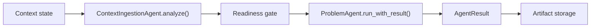

# Контракт Agent Runtime

Дата: 2026-05-14

Обновлено: 2026-07-08 для Phase 1 chat-first architecture.

## Что такое `BaseAgent`

`BaseAgent` - базовый класс для discovery-агентов backend. Он задает общий контракт:

- `artifact_type` определяет тип артефакта, который производит агент.
- `build_prompt(project, existing_artifacts)` формирует prompt для LLM.
- `_deterministic_result(project, existing_artifacts)` возвращает локальный fallback, если LLM не дала usable response.
- `run(project, existing_artifacts)` сохраняет старый публичный контракт и возвращает `str`.
- `run_with_result(project, existing_artifacts, ...)` возвращает расширенный `AgentResult`.

Текущие агенты `ProblemAgent`, `GoalAgent`, `BusinessEffectAgent`, `UseCaseAgent`, `RequirementsAgent` и `CriticAgent` продолжают наследоваться от `BaseAgent`. Их prompt/fallback логика не переписана.

## `run()` и `run_with_result()`

`run()` нужен для обратной совместимости с текущими API endpoints. Он возвращает только строку и не меняет публичный формат `ArtifactRead`.

`run_with_result()` нужен для нового runtime-контракта. Он возвращает `AgentResult`:

- `ok` - удалось ли получить итоговый content, включая fallback.
- `content` - основной текст артефакта.
- `structured_content` - зарезервировано для структурированных результатов.
- `raw_llm_response` - исходный ответ LLM, если он был получен.
- `used_fallback` - был ли использован deterministic fallback.
- `warnings` - runtime warnings, например использование fallback.
- `errors` - ошибки LLM или fallback.
- `source_trace` - будущая трассировка источников.
- `metadata` - runtime metadata: `artifact_type`, `project_id`, trace ids и другие поля.

## `StageProcessorRequest` и `StageProcessorResult`

Для chat-first UX вводится отдельный контракт stage processors. Он не заменяет `AgentResult`; он задает границу для `StageDraftProcessor`, `RequirementsProcessor`, `ValidationProcessor` и Chat Orchestrator.

Физические границы runtime:

- `discovery-ai-agent/backend/app/assistant/` - application service слой AI Discovery Chat: `DiscoveryChatOrchestrator`, `IntentRouter`, `ChatContextAssembler`, `AssistantActionBuilder`, `AssistantResponseBuilder` и chat-only prompt templates.
- `discovery-ai-agent/backend/app/processors/` - stage processing layer: `StageDraftProcessor`, `RequirementsProcessor`, `ValidationProcessor`. Этот слой работает с `StageProcessorRequest/StageProcessorResult` и не пишет в БД.
- `discovery-ai-agent/backend/app/agents/` - Product AI Agents и общий agent runtime. Chat Orchestrator не должен находиться в этом пакете.
- `discovery-ai-agent/backend/app/rag/` - retrieval boundary для SimpleRetriever. Assistant layer может читать retrieval result, processors получают только подготовленный contract.
- `discovery-ai-agent/backend/app/corporate/` - Corporate Tool Gateway / CorporateSource boundary для read-only MCP/MSP adapters.

`StageProcessorRequest`:

- `project_id`;
- `artifact_type`;
- `stage_type`;
- `project_snapshot`;
- `input_artifacts`;
- `context_readiness`;
- `retrieval_result`;
- `user_answers`;
- `prompt_version`;
- `trace_id`;
- `metadata`.

Правила request:

- не хранить API keys, bearer tokens, cookies, passwords, MCP credentials, private provider headers;
- передавать версии и минимальные нужные поля upstream artifacts;
- передавать chunks/evidence вместо полного корпуса документов, если chunks достаточно;
- metadata-only sources не считать evidence.

`StageProcessorResult`:

- `ok`;
- `artifact_type`;
- `content`;
- `structured_content`;
- `proposed_patch`;
- `preview`;
- `human_message`;
- `evidence`;
- `assumptions`;
- `open_questions`;
- `warnings`;
- `errors`;
- `used_fallback`;
- `source_trace`;
- `metadata`.

Правила result:

- user-facing `human_message`, `warnings` и `open_questions` должны быть на русском языке;
- `proposed_patch` не применяется автоматически;
- запись в `discovery_artifacts` допускается только после preview и apply step;
- raw LLM response не отдаётся frontend payload без отдельной redaction policy.
- Chat Orchestrator не формирует domain patch из текста пользователя самостоятельно; он делегирует `StageProcessorRequest` специализированному processor.
- Если processor для artifact type не подключён, Chat Orchestrator возвращает русское сообщение без `proposed_patch`.

## `ToolPolicy` для AI Discovery Chat

`ToolPolicy` - runtime boundary для Chat Orchestrator. Минимальная policy Phase 1:

- allow: `artifact.read`, `context.read`, `completion.read`, `stage.status.read`, `question.create`, `proposed_patch.create`, `patch.preview`;
- conditional allow: `patch.apply` только с `requires_user_confirmation=True`;
- deny: `discovery_artifacts.write`, `credential.read`, `llm_settings.write_secret`, `prompt.raw_log`.

Это фиксирует правило: AI Discovery Chat может подготовить изменение, объяснить его и показать preview, но не может напрямую менять structured state артефакта.

`ApplyPatchService` является отдельным security layer:

- проверяет `project_id`, `session_id`, `action_id`, `action_type` и статус action;
- разрешает apply только для allowlist artifact types;
- проверяет allowlist полей по artifact type и отклоняет неизвестные поля;
- проверяет `base_artifact_version` против текущей версии артефакта;
- блокирует повторный apply и rejected/failed actions;
- пишет в audit только безопасную сводку patch, а не полный текст corporate evidence.

## Fallback

Основной путь выполнения:

1. `BaseAgent` вызывает `build_prompt()`.
2. Runtime вызывает `self.llm.generate(prompt)`.
3. Если LLM вернула непустой текст, этот текст становится `AgentResult.content`.
4. Если LLM вернула пустой текст, вызывается `_deterministic_result()`.
5. Если LLM выбросила exception, вызывается `_deterministic_result()`.
6. В fallback-сценариях `AgentResult.used_fallback=True`, а причина фиксируется в `warnings` и/или `errors`.

Это исправляет прежнее поведение, при котором `BaseAgent.run()` вызывал LLM, но всегда игнорировал ее результат.

## Почему `ContextIngestionAgent.analyze()` не трогали

`ContextIngestionAgent.analyze()` уже имеет отдельный JSON-контракт:

- формирует специализированный context ingestion prompt;
- ожидает JSON;
- нормализует extracted knowledge;
- строит `source_trace`, `coverage`, `readiness` и `problem_handoff`;
- использует собственный deterministic fallback, если JSON невалиден или не содержит полезных данных.

Этот путь не является простым text artifact generation flow. Поэтому изменение `BaseAgent.run()` не должно менять `analyze()`: context ingestion остается отдельным специализированным workflow.

## Будущее подключение LangGraph поверх `AgentResult`

LangGraph не подключается сейчас. Когда собственный runtime будет стабилен, LangGraph можно пилотировать как workflow layer поверх уже существующего контракта:

В таком варианте LangGraph не заменяет React UI, FastAPI backend или доменных агентов. Он только управляет переходами workflow, а каждый узел возвращает `AgentResult` или специализированный context ingestion result.

Перед таким шагом нужно отдельно зафиксировать:

- state persistence;
- trace id propagation;
- rollback behavior;
- human-in-the-loop gates;
- license/dependency approval.
