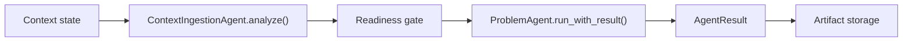

# Agent Runtime Contract

Дата: 2026-05-14

## Что такое `BaseAgent`

`BaseAgent` - базовый класс для discovery-агентов backend. Он задает общий контракт:

- `artifact_type` определяет тип артефакта, который производит агент.
- `build_prompt(project, existing_artifacts)` формирует prompt для LLM.
- `_deterministic_result(project, existing_artifacts)` возвращает локальный fallback, если LLM не дала usable response.
- `run(project, existing_artifacts)` сохраняет старый публичный контракт и возвращает `str`.
- `run_with_result(project, existing_artifacts, ...)` возвращает расширенный `AgentResult`.

Текущие агенты `ProblemAgent`, `GoalAgent`, `BusinessEffectAgent`, `UseCaseAgent`, `RequirementsAgent` и `CriticAgent` продолжают наследоваться от `BaseAgent`. Их prompt/fallback логика не переписана.

## `run()` и `run_with_result()`

`run()` нужен для обратной совместимости с текущими API endpoints. Он возвращает только строку и не меняет публичный формат `ArtifactRead`.

`run_with_result()` нужен для нового runtime-контракта. Он возвращает `AgentResult`:

- `ok` - удалось ли получить итоговый content, включая fallback.
- `content` - основной текст артефакта.
- `structured_content` - зарезервировано для структурированных результатов.
- `raw_llm_response` - исходный ответ LLM, если он был получен.
- `used_fallback` - был ли использован deterministic fallback.
- `warnings` - runtime warnings, например использование fallback.
- `errors` - ошибки LLM или fallback.
- `source_trace` - будущая трассировка источников.
- `metadata` - runtime metadata: `artifact_type`, `project_id`, trace ids и другие поля.

## Fallback

Основной путь выполнения:

1. `BaseAgent` вызывает `build_prompt()`.
2. Runtime вызывает `self.llm.generate(prompt)`.
3. Если LLM вернула непустой текст, этот текст становится `AgentResult.content`.
4. Если LLM вернула пустой текст, вызывается `_deterministic_result()`.
5. Если LLM выбросила exception, вызывается `_deterministic_result()`.
6. В fallback-сценариях `AgentResult.used_fallback=True`, а причина фиксируется в `warnings` и/или `errors`.

Это исправляет прежнее поведение, при котором `BaseAgent.run()` вызывал LLM, но всегда игнорировал ее результат.

## Почему `ContextIngestionAgent.analyze()` не трогали

`ContextIngestionAgent.analyze()` уже имеет отдельный JSON-контракт:

- формирует специализированный context ingestion prompt;
- ожидает JSON;
- нормализует extracted knowledge;
- строит `source_trace`, `coverage`, `readiness` и `problem_handoff`;
- использует собственный deterministic fallback, если JSON невалиден или не содержит полезных данных.

Этот путь не является простым text artifact generation flow. Поэтому изменение `BaseAgent.run()` не должно менять `analyze()`: context ingestion остается отдельным специализированным workflow.

## Будущее подключение LangGraph поверх `AgentResult`

LangGraph не подключается сейчас. Когда собственный runtime будет стабилен, LangGraph можно пилотировать как workflow layer поверх уже существующего контракта:

В таком варианте LangGraph не заменяет React UI, FastAPI backend или доменных агентов. Он только управляет переходами workflow, а каждый узел возвращает `AgentResult` или специализированный context ingestion result.

Перед таким шагом нужно отдельно зафиксировать:

- state persistence;
- trace id propagation;
- rollback behavior;
- human-in-the-loop gates;
- license/dependency approval.
