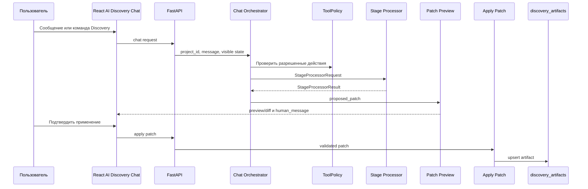

# Контракт Chat Orchestrator

Дата: 2026-07-08  
Статус: Phase 1 contract  
Scope: AI Discovery Chat внутри Product runtime AI Discovery Platform.

## Назначение

Chat Orchestrator - application service backend, который превращает сообщения пользователя в безопасные действия Discovery workflow. Он не заменяет `AgentOrchestrator`, stage processors или формы этапов. Его задача - управлять intent, policy, чтением состояния, proposed patch, preview и apply gate.

## Не смешивать с Global Codex Delivery Agents

`Chat Orchestrator` относится к Product AI Agents/runtime внутри приложения. Global Codex Delivery Agents из `docs/ai-delivery-agents/` используются для разработки, review, QA и delivery. Они не являются runtime-агентами продукта и не вызываются из пользовательского AI Discovery Chat.

## Основной flow



## Intent routing

Минимальные intent types для Phase 2:

| Intent | Действие |
|---|---|
| `explain_state` | Объяснить текущий stage, readiness, missing information. |
| `ask_clarifying_question` | Сформировать вопрос или принять ответ пользователя. |
| `draft_artifact_patch` | Подготовить proposed patch для выбранного artifact type. |
| `preview_patch` | Показать preview/diff без записи. |
| `apply_patch` | Применить patch только после подтверждения пользователя. |
| `validate_workflow` | Запустить validation/critic или объяснить blockers. |

## ToolPolicy

Phase 1 runtime contract:

```python
ToolPolicy.for_ai_discovery_chat()
```

Разрешенные действия:

- `artifact.read`;
- `context.read`;
- `completion.read`;
- `stage.status.read`;
- `question.create`;
- `proposed_patch.create`;
- `patch.preview`.

Условно разрешенное действие:

- `patch.apply` только при `requires_user_confirmation=True`.

Запрещенные действия:

- `discovery_artifacts.write`;
- `credential.read`;
- `llm_settings.write_secret`;
- `prompt.raw_log`.

## StageProcessorRequest

Request создается Chat Orchestrator или stage generation service. Он должен быть минимальным:

- не содержит secrets;
- передает только нужные upstream artifact versions;
- использует chunks/retrieval evidence вместо полного корпуса документов;
- отделяет trusted system instructions от untrusted context chunks;
- содержит `trace_id` и `prompt_version`.

## StageProcessorResult

Result не пишет в storage. Он возвращает:

- `human_message` на русском языке;
- `proposed_patch`, если нужно изменить artifact;
- `preview`, если patch готов к показу;
- `evidence`, `source_trace`, `assumptions`, `open_questions`;
- `warnings/errors` без secrets и raw provider credentials.

## Apply gate

Правила apply:

- patch должен быть создан как `proposed_patch`;
- preview должен быть показан пользователю;
- apply требует явного user confirmation;
- backend валидирует patch allowlist по artifact type;
- audit event должен фиксировать actor, artifact type, previous version, new version, trace id;
- Chat Orchestrator не вызывает прямой write в `discovery_artifacts`.

## Совместимость endpoints

На Phase 2 можно добавить новые chat endpoints, но существующие endpoints остаются совместимыми. Stage-specific endpoints `/stage/{artifact_type}/ask` и `/stage/{artifact_type}/apply-patch` являются совместимым начальным вариантом цепочки proposed patch/apply.

## QA gates

- Test: direct `discovery_artifacts.write` запрещен `ToolPolicy`.
- Test: `patch.apply` без confirmation запрещен.
- Test: proposed patch не меняет storage.
- Test: preview возвращает изменяемые поля.
- Test: apply увеличивает version только после подтверждения.
- Test: user-facing сообщения на русском языке.
- Test: secrets-like поля не попадают в `StageProcessorRequest.metadata`.
