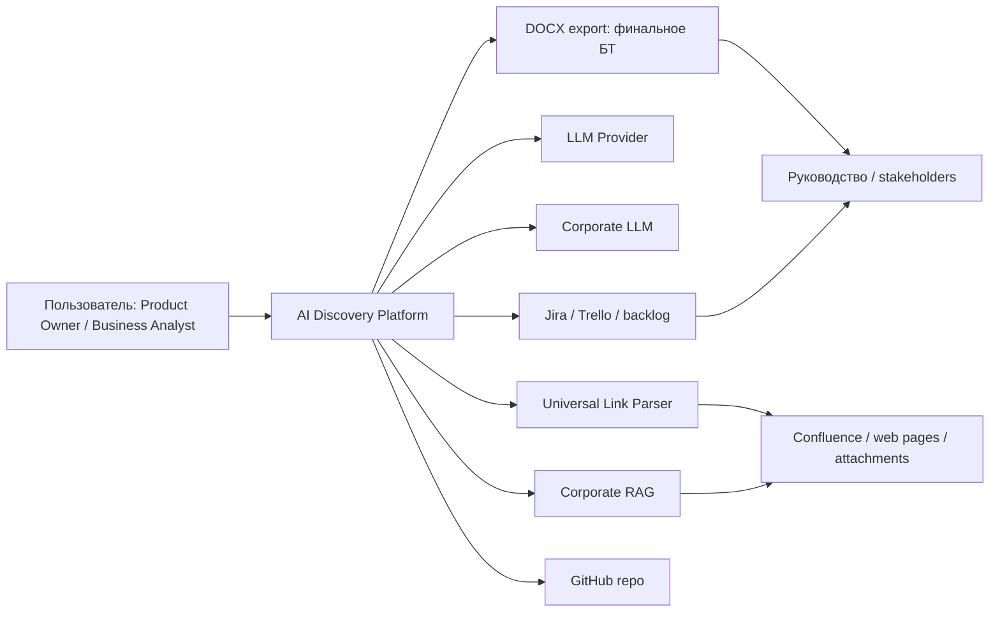

# 01. C4 Context

## Назначение

Схема показывает AI Discovery Platform в окружении пользователей, корпоративных источников, LLM/RAG и delivery-систем.

## Пояснение блоков

- `AI Discovery Platform` - единое рабочее пространство Discovery и подготовки БТ.
- `LLM Provider` и `Corporate LLM` - источники генерации; corporate mode требует security approval.
- `Corporate RAG` и `Universal Link Parser` - target/future контур обработки ссылок и корпоративных знаний.
- `DOCX export` - управленческий и delivery artifact для передачи результата.

## Связанные документы

- [ТЗ целевого состояния](../../system/tz-ai-discovery-platform-target.md)
- [ADR-001](../ADR-001-agent-and-rag-framework-selection.md)
- [RAG/retrieval target design](../../llm-rag/rag-and-retrieval-target-design.md)
- [Trello backlog](../../backlog/trello-cards.md)

## Затронутые backlog/epics

ЭПИК-01, ЭПИК-02, ЭПИК-04, ЭПИК-08, ЭПИК-09, ЭПИК-12, ЭПИК-17, Issue #75.

