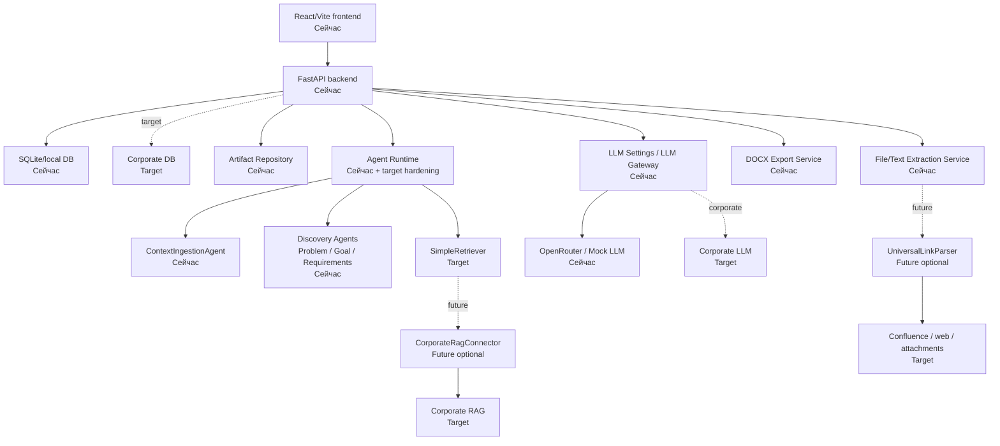

# 02. C4 Container

## Назначение

Схема показывает основные контейнеры текущего MVP и целевого corporate-контура.

## Пояснение блоков

- `Сейчас` - уже присутствует в MVP или current docs.
- `Target` - целевой промышленный контур.
- `Future optional` - расширение после security/design approval.

## Связанные документы

- [Target architecture](../target-architecture.md)
- [Agent Runtime Contract](../agent-runtime-contract.md)
- [SimpleRetriever Contract](../simple-retriever-contract.md)
- [Current OpenAPI contract](../../api/openapi-contracts-current.md)

## Затронутые backlog/epics

ЭПИК-02, ЭПИК-03, ЭПИК-04, ЭПИК-08, ЭПИК-09, ЭПИК-11, ЭПИК-12, Issue #75.

