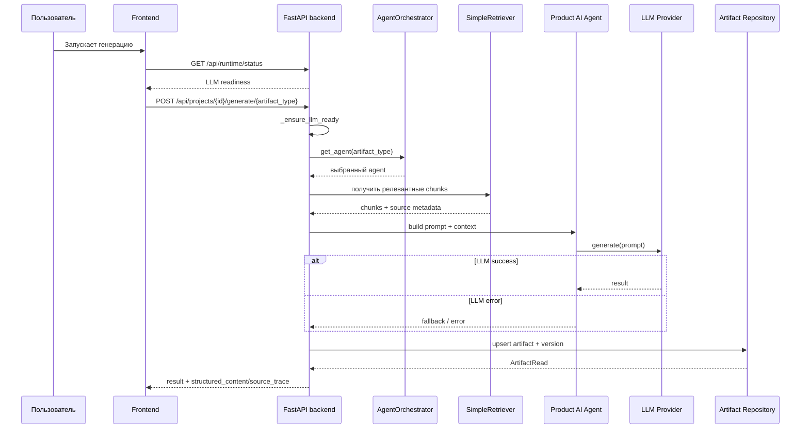

# 03. Agent Runtime Flow

## Назначение

Схема фиксирует целевой flow генерации artifact через backend Agent Runtime продукта.

## Пояснение блоков

`AgentOrchestrator` здесь является product runtime orchestrator внутри backend, а не глобальным Codex delivery agent. `SimpleRetriever` добавляет grounding и source trace для целевого контура.

## Связанные документы

- [Agent Runtime Contract](../agent-runtime-contract.md)
- [SimpleRetriever Contract](../simple-retriever-contract.md)
- [Current OpenAPI contract](../../api/openapi-contracts-current.md)
- [RAG/retrieval target design](../../llm-rag/rag-and-retrieval-target-design.md)

## Затронутые backlog/epics

ЭПИК-03, ЭПИК-04, ЭПИК-05, ЭПИК-07, BE-02-01.

