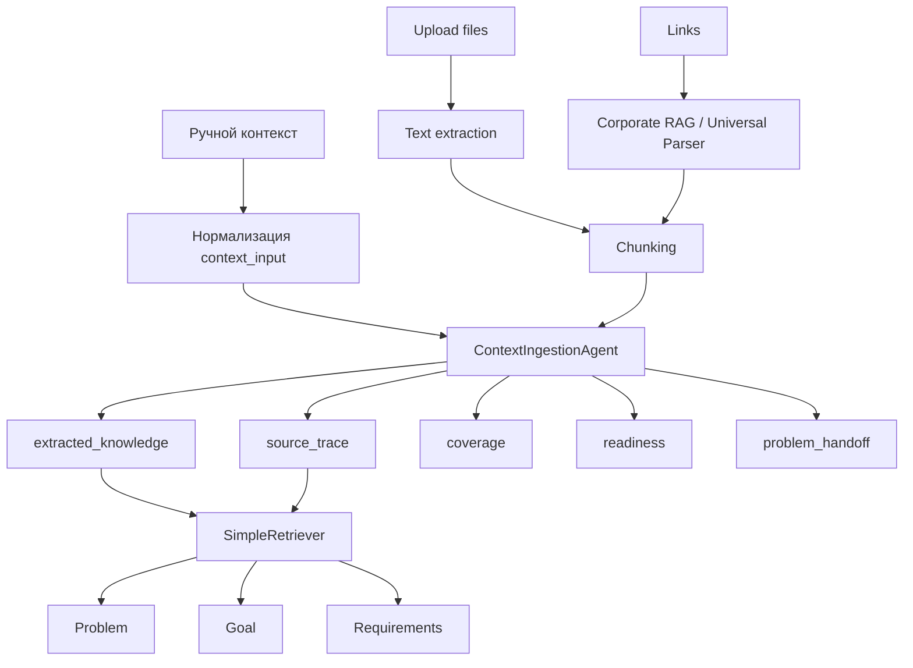

# 04. Context Ingestion и RAG

## Назначение

Схема показывает путь от ручного контекста, файлов и ссылок до `source_trace`, `coverage`, `readiness` и downstream stages.

## Пояснение блоков

- `Text extraction` покрывает txt, md, csv, docx, pdf, xlsx; `xls` сейчас требует отдельного решения.
- `source_trace` связывает вывод AI с источниками.
- `readiness` определяет, можно ли переходить к Problem.

## Связанные документы

- [RAG/retrieval target design](../../llm-rag/rag-and-retrieval-target-design.md)
- [SimpleRetriever Contract](../simple-retriever-contract.md)
- [Current OpenAPI contract](../../api/openapi-contracts-current.md)
- [ТЗ](../../system/tz-ai-discovery-platform-target.md)

## Затронутые backlog/epics

ЭПИК-02, ЭПИК-04, ЭПИК-05, BE-03-01, Issue #75.

