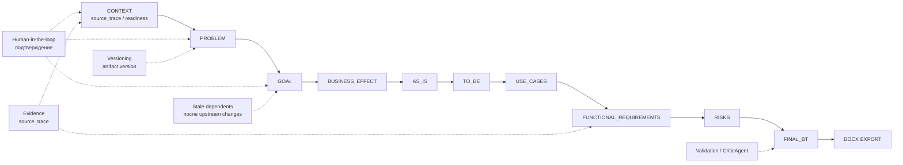

# 05. Discovery Artifact Lifecycle

## Назначение

Схема показывает жизненный цикл Discovery artifacts от CONTEXT до DOCX export.

## Пояснение блоков

Каждый artifact сохраняется с version. При изменении upstream artifact downstream stages могут стать stale. AI предлагает, пользователь подтверждает, затем artifact становится входом для следующего этапа.

## Связанные документы

- [ТЗ](../../system/tz-ai-discovery-platform-target.md)
- [Current OpenAPI contract](../../api/openapi-contracts-current.md)
- [Agent Runtime Contract](../agent-runtime-contract.md)

## Затронутые backlog/epics

ЭПИК-01, ЭПИК-05, ЭПИК-06, ЭПИК-07, ЭПИК-08, ЭПИК-11, ЭПИК-15.

