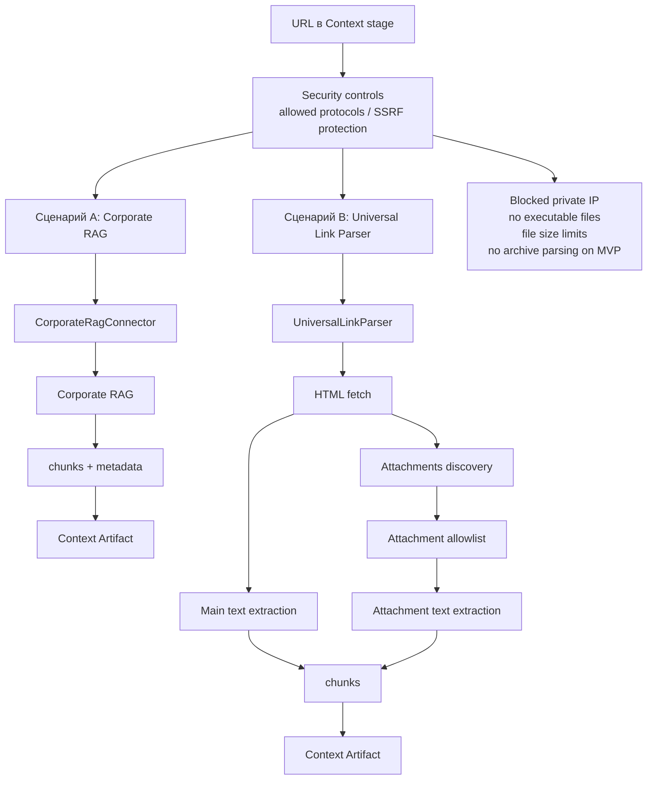

# 06. Обработка ссылок через Corporate RAG и Universal Parser

## Назначение

Схема фиксирует target design для backlog issue `#75`: обработка ссылок в контексте через Corporate RAG и Universal Link Parser.

## Security controls

- SSRF protection.
- Allowed protocols: `https` и approved `http` only для внутренних trusted сетей.
- Blocked private IP и loopback targets для public parser mode.
- File size limits для HTML и attachments.
- Attachment allowlist: txt, md, csv, docx, pdf, xlsx.
- No executable files.
- No archive parsing on MVP.

## Связанные документы

- [RAG/retrieval target design](../../llm-rag/rag-and-retrieval-target-design.md)
- [SimpleRetriever Contract](../simple-retriever-contract.md)
- [ТЗ](../../system/tz-ai-discovery-platform-target.md)
- [Security requirements](../../security/security-requirements.md)

## Затронутые backlog/epics

Issue #75, ЭПИК-02, ЭПИК-04, ЭПИК-09, ЭПИК-12, BE-03-01.

