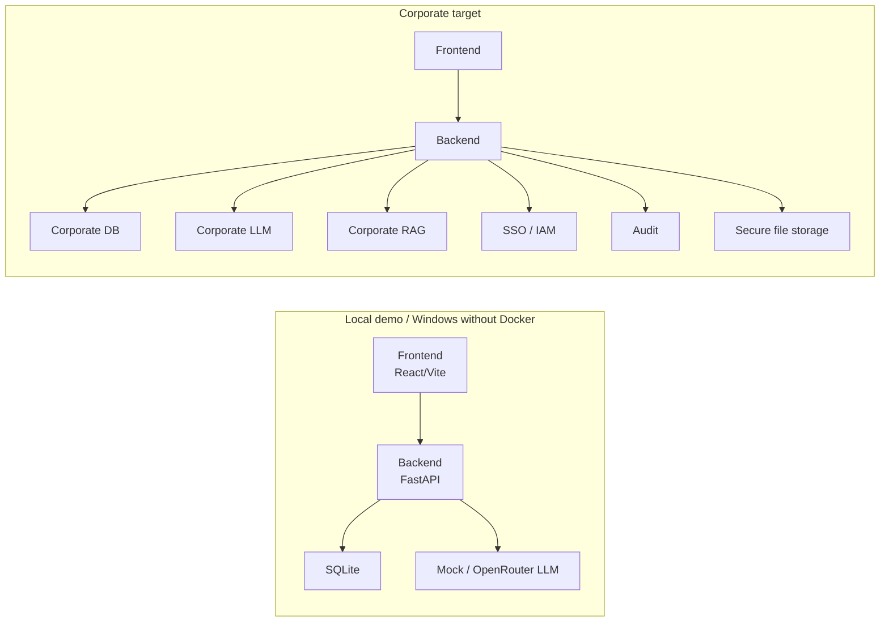

# 07. Deployment: local demo и corporate target

## Назначение

Схема показывает два режима deployment: текущий local demo и целевой corporate target.

## Пояснение блоков

Local demo нужен для разработки и демонстраций без Docker. Corporate target нужен для production/pilot: SSO, audit, secure storage, corporate DB, corporate LLM и corporate RAG.

## Связанные документы

- [Runbook локального запуска](../../runbook/local-runbook.md)
- [Target architecture](../target-architecture.md)
- [Security requirements](../../security/security-requirements.md)
- [TЗ](../../system/tz-ai-discovery-platform-target.md)

## Затронутые backlog/epics

ЭПИК-09, ЭПИК-11, ЭПИК-12, ЭПИК-14, ЭПИК-15.

