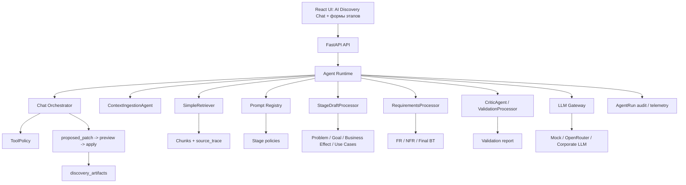

# Целевая архитектура Product AI Agents

Дата: 2026-05-22  
Статус: target-state draft, требует утверждения перед реализацией  
Область: backend Product AI Agents и Agent Runtime AI Discovery Platform  
Важно: документ не описывает Global Codex Delivery Agents.

## 1. Назначение

Документ фиксирует целевую модель Product AI Agents после архитектурного review. Цель - снизить избыточность текущей agent-модели, сохранить Discovery workflow и подготовить платформу к корпоративному внедрению без лишнего security/architecture approval overhead.

Связанные документы:

- [Экспертный review архитектуры Product AI Agents](product-ai-agents-architecture-review.md);
- [ADR-003 Product AI Agents target architecture](ADR-003-product-ai-agents-target-architecture.md);
- [ADR-004 AI Discovery Chat Architecture](ADR-004-ai-discovery-chat-architecture.md);
- [Chat Orchestrator Contract](chat-orchestrator-contract.md);
- [Agent Runtime Contract](agent-runtime-contract.md);
- [SimpleRetriever Contract](simple-retriever-contract.md);
- [ADR-001 AI/RAG/framework selection](ADR-001-agent-and-rag-framework-selection.md);
- [RAG/retrieval target design](../llm-rag/rag-and-retrieval-target-design.md);
- [ТЗ целевого состояния](../system/tz-ai-discovery-platform-target.md).

## 2. Целевой принцип

Product AI Agents не должны моделироваться как набор независимых AI-сервисов. Целевая формулировка:

> AI Discovery Platform имеет единый Agent Runtime, который запускает управляемые режимы генерации Discovery-артефактов через AI Discovery Chat, Chat Orchestrator, stage processors, prompt registry, LLM Gateway, retrieval boundary и единый audit/telemetry layer.

## 3. Целевая схема



## 4. Компоненты

| Компонент | Назначение | Почему отдельный |
|---|---|---|
| `AgentRuntime` | Единый запуск, trace id, error/fallback policy, metadata, audit. | Это cross-cutting слой, общий для всех AI-операций. |
| `ChatOrchestrator` | Управляет chat intent, stage selection, policy checks, proposed patch, preview и apply gate. | AI Discovery Chat является UX-входом, но не должен напрямую писать structured state. |
| `ToolPolicy` | Разрешает read/proposed_patch/preview и apply с подтверждением; запрещает прямую запись и доступ к secrets. | Нужен явный security boundary для chat-first UX. |
| `ContextIngestionAgent` | Извлекает и нормализует контекст, формирует `source_trace`, `coverage`, `readiness`, `problem_handoff`. | Имеет отдельный JSON-контракт и специфичную source logic. |
| `StageDraftProcessor` | Генерирует draft артефактов Problem, Goal, Business Effect, Use Cases по stage policy. | Уменьшает дублирование stage prompt wrappers. |
| `RequirementsProcessor` | Генерирует FR/NFR/Final BT с IDs, acceptance criteria, dependencies, evidence. | Требования имеют более строгий contract и delivery impact. |
| `CriticAgent` / `ValidationProcessor` | Проверяет полноту, противоречия, missing information и readiness. | Валидация отличается от генерации и должна быть независимой. |
| `SimpleRetriever` | Возвращает chunks/evidence поверх context artifact. | Retrieval boundary не должен расползаться по агентам. |
| `PromptRegistry` | Хранит prompt templates, version, owner, output schema, evidence policy. | Нужен governance и rollback prompt-изменений. |
| `LLM Gateway` | Единая абстракция provider/model/timeout/error mapping. | Нельзя давать каждому stage отдельное подключение и secrets. |

## 5. Stage classification

| Stage / Artifact | Целевая обработка | Evidence requirement |
|---|---|---|
| `CONTEXT` | `ContextIngestionAgent` | Источники, chunks, metadata-only reasons, `source_trace`. |
| `PROBLEM` | `StageDraftProcessor` с `problem_template` | Обязательно: `problem_handoff`, context readiness, retrieval evidence. |
| `GOAL` | `StageDraftProcessor` с `goal_template` | Обязательно: Problem evidence, KPI/context chunks или open questions. |
| `BUSINESS_EFFECT` | `StageDraftProcessor` с `business_effect_template` | Желательно: KPI, constraints, assumptions. |
| `USE_CASES` | `StageDraftProcessor` с `use_cases_template` | Желательно: roles, systems, process chunks. |
| `FUNCTIONAL_REQUIREMENTS` | `RequirementsProcessor` | Обязательно: derived_from/evidence/assumption marker. |
| `NON_FUNCTIONAL_REQUIREMENTS` | `RequirementsProcessor` | Обязательно: NFR category, evidence or assumption. |
| `FINAL_BT` | `RequirementsProcessor` или future `DocumentAssemblyProcessor` | Обязательно: версии артефактов, source summary, validation status. |
| `VALIDATION_REPORT` | `CriticAgent` / `ValidationProcessor` | Обязательно: проверяемые rules, warnings, contradictions. |

## 6. Stage policy

Stage policy - это конфигурация режима генерации, а не отдельный backend service.

```yaml
stage: PROBLEM
artifact_type: PROBLEM
prompt_version: problem.v1
required_inputs:
  - CONTEXT
required_context:
  - problem_handoff
  - readiness
retrieval_query_policy: problem
output_schema: problem_structured_content.v1
evidence_required: true
fallback_allowed: true
```

Минимальные поля policy:

- `stage`;
- `artifact_type`;
- `prompt_version`;
- `required_inputs`;
- `optional_inputs`;
- `retrieval_query_policy`;
- `output_schema`;
- `evidence_required`;
- `fallback_allowed`;
- `human_review_required`;
- `stale_downstream_on_change`.

## 7. StageProcessorRequest

```python
class StageProcessorRequest:
    project_id: str
    artifact_type: str
    stage_type: str
    project_snapshot: dict
    input_artifacts: dict
    context_readiness: dict
    retrieval_result: dict | None
    user_answers: list[dict]
    prompt_version: str
    trace_id: str
    metadata: dict
```

Правила:

- request не должен содержать API keys, bearer tokens, private provider headers;
- request не должен содержать cookies, MCP credentials, `.env` values или secrets из LLM settings;
- request должен содержать только нужные upstream artifact versions;
- metadata-only source не должен попадать как evidence;
- full documents не передаются в LLM, если достаточно chunks.

## 8. StageProcessorResult

```python
class StageProcessorResult:
    ok: bool
    artifact_type: str
    content: str
    structured_content: dict
    proposed_patch: dict
    preview: dict
    human_message: str
    evidence: list[dict]
    assumptions: list[str]
    open_questions: list[str]
    warnings: list[str]
    errors: list[str]
    used_fallback: bool
    source_trace: list[dict]
    metadata: dict
```

Правила:

- `human_message` и user-facing warnings должны быть на русском языке;
- `proposed_patch` не применяется автоматически и должен пройти preview/apply gate;
- `evidence` должен ссылаться на `source_id`, `chunk_id`, `source_name`;
- если evidence недостаточно, result должен явно вернуть assumptions/open_questions;
- `raw_llm_response` допускается только в internal metadata с redaction policy, не как публичный frontend payload.

## 8.1 ToolPolicy для AI Discovery Chat

Минимальная policy:

```yaml
allowed_actions:
  - artifact.read
  - context.read
  - completion.read
  - stage.status.read
  - question.create
  - proposed_patch.create
  - patch.preview
conditional_actions:
  patch.apply: requires_user_confirmation
denied_actions:
  - discovery_artifacts.write
  - credential.read
  - llm_settings.write_secret
  - prompt.raw_log
```

Chat Orchestrator обязан проверять policy до вызова tool/action. Stage processors не получают capability прямой записи в БД.

## 9. Prompt governance

Prompt governance - управление prompt-шаблонами, их версиями и правилами применения.

Минимальные требования:

- каждый prompt имеет `prompt_id`, `version`, `stage`, `owner`, `status`;
- prompt меняется через review, а не silent edit;
- stage prompt задаёт output schema и language;
- prompt явно отделяет trusted instructions от untrusted source chunks;
- prompt содержит правило: если факта нет в источниках, вернуть open question или assumption;
- для production нужен prompt regression set.

## 10. Corporate deployment model

Для корпоративного согласования модель должна звучать так:

- один backend Agent Runtime;
- один LLM Gateway;
- один prompt registry;
- один audit/telemetry layer;
- один retrieval boundary;
- несколько режимов генерации по этапам Discovery;
- нет отдельных secrets на каждый stage;
- нет отдельных сетевых подключений на каждый stage;
- нет автономного tool execution без allowlist.

Это снижает overhead ИБ, архитектурного комитета и сопровождения.

## 11. Migration without breaking endpoints

Endpoint paths должны сохраняться до отдельного versioned API decision:

- `/api/projects/{project_id}/generate/{artifact_type}`;
- `/api/projects/{project_id}/problem/generate`;
- `/api/projects/{project_id}/goal/generate`;
- `/api/projects/{project_id}/stage/{artifact_type}/questions`;
- `/api/projects/{project_id}/stage/{artifact_type}/ask`;
- `/api/projects/{project_id}/stage/{artifact_type}/apply-patch`;
- `/api/projects/{project_id}/validate`.

Миграционный подход:

1. Ввести unified result contract без изменения response compatibility.
2. Ввести stage policies в documentation/tests.
3. Добавить `StageDraftProcessor` как internal implementation behind existing routes.
4. Оставить old classes как compatibility wrappers на переходный период.
5. После regression и release notes депрецировать лишние wrappers.

## 12. Quality gates

| Gate | Что проверить |
|---|---|
| Product gate | UI показывает этапы и readiness, а не внутреннюю сложность агентов. |
| Architecture gate | Нет overengineering и лишних AI-сервисов; runtime remains own backend component. |
| Backend gate | Existing API paths и success responses не сломаны. |
| LLM/RAG gate | Evidence, prompt version, source_trace, token budget, fallback policy описаны. |
| Security gate | Нет secrets per agent, нет raw prompts/logs без policy, есть prompt injection controls, AI Discovery Chat не пишет в `discovery_artifacts` без `proposed_patch -> preview -> apply`. |
| QA gate | Есть contract tests, prompt regression, golden examples. |
| Documentation gate | Product AI Agents и Global Codex Delivery Agents не смешаны. |
| Delivery gate | Backlog/Gantt обновлены как draft, Trello API sync не утверждается без факта. |

## 13. Open questions

- Нужен ли отдельный `DocumentAssemblyProcessor` для Final BT.
- Где физически хранить prompt registry в MVP: code/config/docs/DB.
- Какие stages входят в первую миграционную волну.
- Какие golden datasets доступны для Problem/Goal/Requirements.
- Нужно ли хранить raw LLM response для отладки или достаточно redacted diagnostics.
