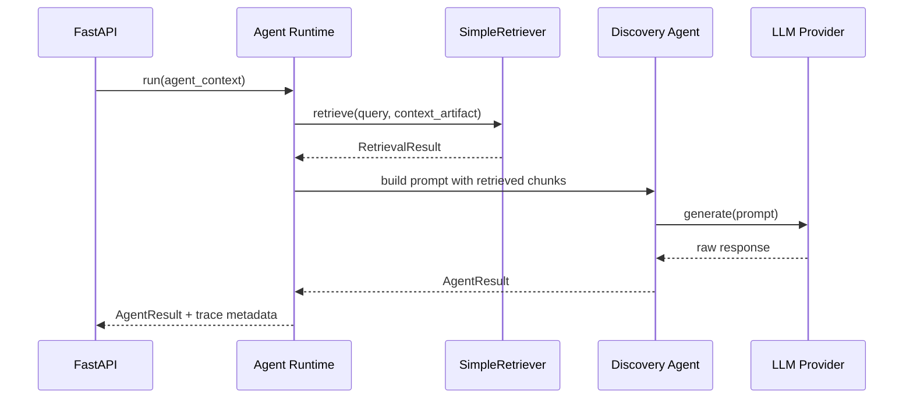

# Контракт SimpleRetriever

Дата: 2026-05-17

Статус: draft

## Назначение

`SimpleRetriever` - минимальный внутренний retrieval component для AI Discovery Platform. Он работает без новых внешних RAG-зависимостей, использует уже извлеченный текст, chunks и metadata из context artifact, возвращает релевантные фрагменты с traceable evidence и готовит стабильную boundary для будущих LlamaIndex/Haystack adapters.

## Не является

`SimpleRetriever` не является:

- vector database;
- embedding service;
- заменой `ContextIngestionAgent`;
- заменой LLM provider;
- внешним RAG framework;
- публичным API для frontend;
- долгосрочной заменой всех advanced RAG capabilities.

## Входной контракт

```python
class RetrievalQuery:
    project_id: str
    query: str
    artifact_type: str | None
    stage: str | None
    context_artifact: dict
    filters: dict
    top_k: int
    max_chars: int
    trace_id: str | None
```

Поля:

| Поле | Обязательное | Описание |
|---|---:|---|
| `project_id` | Да | Идентификатор проекта |
| `query` | Да | Текст запроса или prompt intent |
| `artifact_type` | Нет | Целевой artifact type, например `PROBLEM` |
| `stage` | Нет | Discovery stage |
| `context_artifact` | Да | Structured content артефакта `CONTEXT` |
| `filters` | Нет | Фильтры по source type, source id, content level |
| `top_k` | Нет | Максимум возвращаемых chunks |
| `max_chars` | Нет | Бюджет символов для retrieval result |
| `trace_id` | Нет | Сквозной trace id runtime-запуска |

Значения по умолчанию:

- `top_k`: 5;
- `max_chars`: 12000;
- `filters`: `{}`;

## Источники данных

`SimpleRetriever` читает только данные, уже переданные в context artifact:

- `context_input`;
- `documents`;
- `uploaded_files`;
- `links`;
- `extracted_text`;
- `text_content`;
- `fetched_content`;
- `summary`;
- `chunks`;
- `source_trace`;
- `extracted_knowledge`;
- `problem_handoff`.

Если источник имеет только metadata и не имеет usable text/chunks, retriever не должен выдавать его как evidence chunk. Он может вернуть warning о metadata-only source.

## Нормализация источника

Внутренняя модель source:

```python
class RetrievalSource:
    source_id: str
    source_type: str
    source_name: str
    content_level: str
    text_extraction_status: str | None
    text: str
    chunks: list[dict]
    metadata: dict
```

Правила:

- `source_id` берется из `id`, иначе генерируется stable local id в рамках запроса.
- `source_name` берется из `name`, `title`, `fileName`, `url`.
- `content_level` должен соответствовать фактическому содержимому: `chunks`, `extracted_text`, `text_content`, `fetched_content`, `summary`, `metadata_only`.
- `metadata_only` не участвует в scoring как evidence.

## Выходной контракт

```python
class RetrievalResult:
    ok: bool
    query: str
    chunks: list[RetrievedChunk]
    source_trace: list[dict]
    warnings: list[str]
    errors: list[str]
    metadata: dict
```

```python
class RetrievedChunk:
    chunk_id: str
    source_id: str
    source_type: str
    source_name: str
    text: str
    score: float
    rank: int
    reason: str
    content_level: str
    chunk_order: int | None
    metadata: dict
```

## Semantics

- `ok=True`, если retriever выполнился без runtime error, даже если chunks пусты.
- Пустой список chunks означает отсутствие подходящих evidence, а не обязательно ошибку.
- `warnings` используются для metadata-only sources, empty query, truncation, low confidence.
- `errors` используются для некорректного input contract или непредвиденной ошибки.
- `metadata` содержит `trace_id`, `top_k`, `max_chars`, `sources_seen`, `sources_used`, `algorithm_version`.

## Scoring baseline

Первая версия не использует embeddings. Допустимый baseline:

1. Нормализовать `query`: lowercase, убрать лишние пробелы, выделить tokens.
2. Нормализовать chunk text.
3. Посчитать lexical overlap по tokens.
4. Усилить score для chunks из источников с `used=True` в `source_trace`.
5. Усилить score для chunks, где встречаются business terms из `extracted_knowledge`.
6. Понизить score для слишком коротких или почти пустых chunks.
7. Отсортировать по score, затем по source priority и chunk order.

Минимальный score не должен быть жестким на первом этапе. Лучше вернуть low-confidence chunks с warning, чем скрыть весь evidence.

## Source trace

Каждый `RetrievedChunk` должен быть связываем с source trace:

```json
{
  "source_id": "doc_123",
  "source_type": "document",
  "source_name": "Описание процесса.docx",
  "used": true,
  "content_level": "chunks",
  "chunks_count": 8,
  "reason": "Источник использован retriever: найдено совпадение с запросом."
}
```

Если исходный `source_trace` уже существует, retriever должен переиспользовать его поля и добавлять retrieval-specific reason только в metadata/result, не затирая первичный ingestion trace.

## Интеграция с Agent Runtime

Целевая последовательность:



Runtime отвечает за то, какие agents получают retrieval context. Retriever не должен сам вызывать LLM.

## Интеграция с agents

Первичные consumers:

- `ContextIngestionAgent`: может использовать retrieval для evidence normalization, но не должен терять текущий JSON-контракт.
- `ProblemAgent`: использует retrieved chunks и `problem_handoff` для grounded problem statement.

Не нужно сразу подключать все agents. Каждый новый consumer должен иметь tests на:

- отсутствие retrieval result;
- metadata-only sources;
- low-confidence chunks;
- source trace propagation;
- fallback без retrieval.

## Prompt budget

Retriever должен отдавать runtime не больше `max_chars`. Runtime может дополнительно сжать result перед prompt.

Правила:

- top-k ограничен;
- длинные chunks truncatable с явным `truncated=True` в metadata;
- нельзя silently обрезать source id/source name;
- prompt должен содержать только необходимые evidence snippets.

## Error и fallback policy

| Сценарий | Поведение |
|---|---|
| Нет context artifact | `ok=False`, error `CONTEXT_ARTIFACT_REQUIRED` |
| Нет usable text/chunks | `ok=True`, chunks `[]`, warning |
| Query пустой | `ok=True`, chunks из high-priority context summary или `[]`, warning |
| Ошибка normalization | `ok=False`, controlled error |
| Превышен budget | `ok=True`, chunks truncated, warning |

Agent Runtime при retrieval error должен решить, можно ли продолжать без retrieval. Для `ProblemAgent` допустим режим fallback к `problem_handoff` и context summary.

## Adapter compatibility

Будущие LlamaIndex/Haystack adapters должны реализовать тот же выходной контракт. Запрещено возвращать во frontend framework-native objects.

Допустимое adapter metadata:

```json
{
  "adapter": "llamaindex",
  "adapter_version": "x.y.z",
  "index_type": "local",
  "diagnostics": {}
}
```

Эти поля diagnostic-only и не должны быть обязательными для UI или agents.

## Quality gate

Перед подключением к production flow:

- unit tests для normalization и scoring;
- tests для metadata-only sources;
- tests для top-k и max_chars;
- tests для source_trace propagation;
- tests для отключенного retrieval;
- ручная проверка на реальных context artifacts;
- подтверждение, что dependency manifests не изменены.

