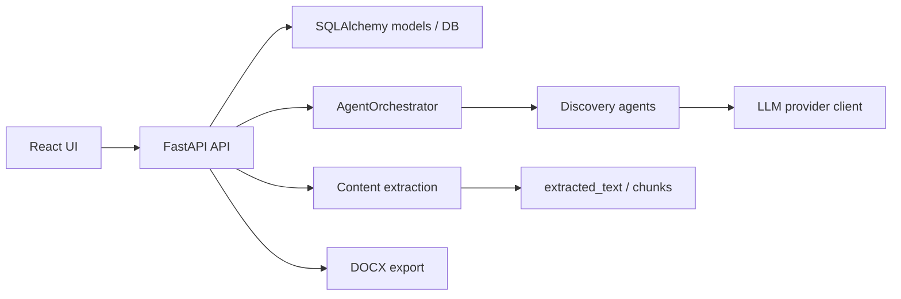
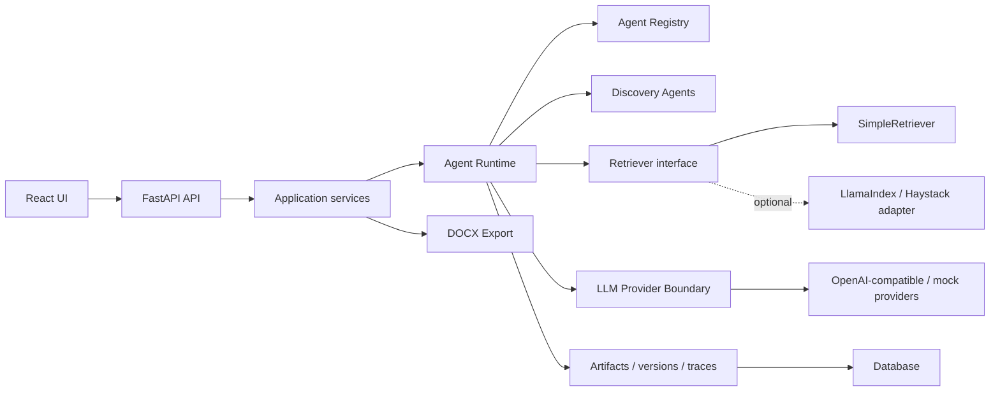
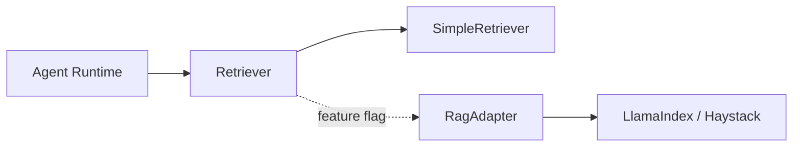
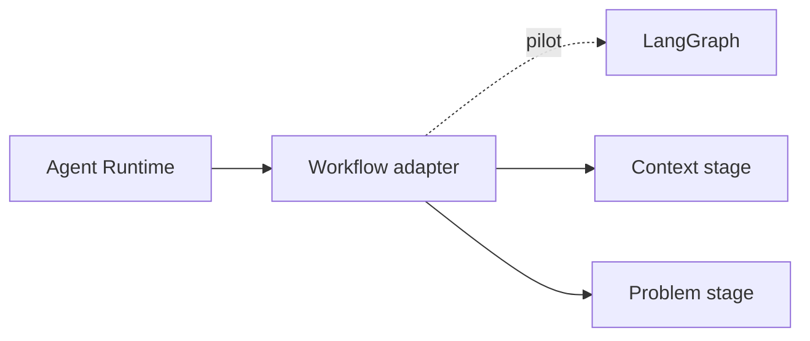

# Целевая архитектура AI Discovery Platform

Дата: 2026-05-17

Статус: draft

## Назначение

Документ описывает целевую архитектуру эволюции AI Discovery Platform без переписывания продукта на внешние AI/RAG платформы. Фокус: React/FastAPI, собственный `Agent Runtime`, внутренний `SimpleRetriever`, adapter boundary для будущих RAG/workflow frameworks, трассируемость источников и управляемый rollout.

## Архитектурные принципы

- Сохранять React frontend и FastAPI backend как product foundation.
- Внешние AI/RAG/workflow frameworks использовать только как optional adapters.
- Не пропускать framework-specific модели в публичный API и UI.
- Все AI-результаты должны иметь traceable input: project, artifact versions, context sources, chunks, LLM metadata.
- Retrieval должен быть отключаемым и иметь deterministic fallback.
- Новые dependencies проходят license/dependency gate до включения в production.
- Runtime сначала стабилизируется внутри продукта, затем расширяется через adapters.

## Текущий контур

Текущие ключевые элементы:

- frontend работает с projects, artifacts, context, LLM settings и export;
- backend хранит `DiscoveryProject` и `DiscoveryArtifact`;
- `ContextIngestionAgent` формирует `extracted_knowledge`, `source_trace`, `coverage`, `readiness`, `problem_handoff`;
- `BaseAgent` поддерживает `run()` и `run_with_result()`;
- `AgentResult` уже содержит `content`, `structured_content`, `raw_llm_response`, `used_fallback`, `warnings`, `errors`, `source_trace`, `metadata`;
- LLM providers скрыты за `BaseLLMClient.generate(prompt)`.

## Целевая схема

## Контейнеры и границы

| Контейнер | Ответственность | Не отвечает за |
|---|---|---|
| React UI | Ввод контекста, просмотр stages, редактирование артефактов, настройки LLM, export actions | RAG orchestration, prompt assembly, framework-specific state |
| FastAPI API | HTTP boundary, auth в будущем, validation, orchestration application services | Хранение секретов в логах, прямое протекание adapter-specific объектов в UI |
| Application services | Use case orchestration: context analyze, artifact generate, export, settings | Низкоуровневый graph/RAG implementation |
| Agent Runtime | Единый запуск agents, metadata, trace, fallback, error policy, readiness gates | UI rendering, DB schema ownership, external framework lifecycle |
| Discovery Agents | Доменные prompts и structured outputs по discovery stages | Выбор RAG framework, хранение API keys, HTTP routing |
| Retriever interface | Поиск релевантных chunks и source evidence | Генерация LLM-ответов, хранение артефактов |
| SimpleRetriever | Минимальный in-house retrieval по existing chunks/text без новых RAG dependencies | Vector DB, embeddings, external connectors |
| RagAdapter | Optional integration с LlamaIndex/Haystack за внутренним интерфейсом | Замена Agent Runtime и доменной модели |
| LLM Provider Boundary | Единый вызов LLM, provider/model metadata, timeout/error mapping | Prompt business logic и storage |
| Artifact Store | Projects, artifacts, versions, structured content, source traces | Runtime decision logic |

## Agent Runtime

Целевой `Agent Runtime` должен быть внутренним слоем backend между API/application services и доменными agents.

Минимальный контракт:

- input: `AgentContext`;
- output: `AgentResult`;
- registry: `artifact_type -> agent`;
- metadata propagation: `trace_id`, `run_id`, `project_id`, `artifact_type`;
- source binding: `source_artifact_versions`, `source_trace`, `retrieved_chunks`;
- LLM metadata: provider, model, timeout, temperature;
- policies: fallback, retry, warning/error mapping;
- readiness gates для переходов между stages.

Runtime не обязан сразу быть отдельным package. Важно, чтобы ownership и boundaries были явными.

## Retrieval architecture

`SimpleRetriever` размещается за внутренним `Retriever` interface.

Источники данных:

- `CONTEXT.structured_content.context_input`;
- `documents`;
- `uploaded_files`;
- `links`;
- `extracted_text`;
- `chunks`;
- `source_trace`;
- `knowledge_history`.

Потребители:

- `ContextIngestionAgent` для нормализации и evidence;
- `ProblemAgent` для grounded problem generation;
- будущие stages, если им нужен evidence-aware prompt.

Retrieval result должен возвращать не только text, но и evidence metadata: source id, source name, content level, chunk order, score, reason и trace reference.

## Adapter boundary

LlamaIndex/Haystack подключаются только за boundary:

Правила:

- UI не знает о конкретном framework;
- API возвращает внутренний response contract;
- adapter-specific metadata хранится только в debug/diagnostic metadata;
- adapter можно отключить без миграции пользовательских артефактов;
- dependency добавляется только после license/dependency gate.

## Workflow boundary

LangGraph не является foundation. Возможное место LangGraph:

Первый допустимый pilot: `Context -> readiness gate -> Problem -> clarification -> apply patch`.

До pilot нужны:

- стабильный `AgentResult`;
- trace propagation;
- rollback behavior;
- persistence boundary;
- human-in-the-loop decision points;
- отключаемый adapter.

## Данные и трассируемость

Целевые trace fields:

| Поле | Назначение |
|---|---|
| `trace_id` | Сквозной идентификатор AI-запуска |
| `run_id` | Идентификатор конкретного запуска agent/runtime |
| `project_id` | Проект |
| `artifact_type` | Целевой артефакт |
| `source_artifact_versions` | Версии входных артефактов |
| `source_trace` | Использованные источники контекста |
| `retrieved_chunks` | Chunks, переданные в prompt |
| `prompt_version` | Версия prompt/template |
| `llm_provider` | Провайдер |
| `llm_model` | Модель |
| `used_fallback` | Признак fallback |
| `warnings` / `errors` | Контролируемые runtime messages |

## API principles

- Публичные endpoints остаются discovery-oriented: projects, artifacts, context, stages, export.
- Runtime и retriever не раскрываются как framework API.
- Для диагностики можно добавить internal/debug metadata, но без секретов и raw credentials.
- `ArtifactRead` и structured content остаются основой взаимодействия с frontend.

## Нефункциональные требования

| Категория | Целевое требование |
|---|---|
| Reliability | Fallback при LLM/retrieval ошибках там, где stage допускает fallback |
| Observability | Trace id, warnings, errors, LLM metadata, retrieval metadata |
| Security | Не логировать API keys, prompts с приватными данными без redaction policy |
| Privacy | Явно документировать, какие данные отправляются во внешний LLM |
| Performance | Ограничивать top-k, размер chunks и prompt budget |
| Maintainability | Framework-specific код только внутри adapters |
| Portability | Базовый режим работает без LlamaIndex/Haystack/LangGraph |
| License safety | Новые dependencies только через gate |

## Rollout

1. Документировать архитектуру и контракты.
2. Укрепить runtime contract без изменения UX.
3. Добавить `SimpleRetriever` в backend за feature flag.
4. Подключить `ProblemAgent` к retrieval context.
5. Добавить runtime/retrieval tests.
6. Пилотировать RAG adapter в отдельной ветке.
7. Пилотировать LangGraph только после runtime quality gate.

## Rollback

- Отключить retrieval feature flag.
- Вернуть agents к использованию текущего context artifact.
- Отключить adapter и использовать `SimpleRetriever`.
- Отключить workflow adapter и использовать `AgentOrchestrator`.
- Не выполнять необратимые DB migrations без отдельного ADR.

## Open questions

- Нужна ли отдельная таблица для AI run traces или достаточно structured metadata в artifact versions на первом этапе?
- Какие stages, кроме `Problem`, первыми получают retrieval context?
- Нужен ли vector store до появления реальных объемов документов?
- Какие telemetry fields допустимы для корпоративного контура?

## Handoff

- Backend: спроектировать runtime/retriever interfaces и tests.
- LLM/RAG: определить scoring baseline и prompt budget.
- Security: проверить data flow, secrets, dependency policy.
- QA: покрыть fallback, source trace, readiness и adapter-off режим.
- DevOps: подготовить feature flags и dependency rollout/rollback.

