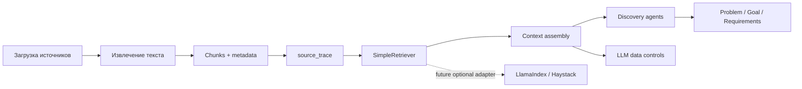

# Целевая RAG-архитектура и retrieval design

Дата: 2026-05-17

Статус: целевой дизайн

## Контекст

AI Discovery Platform уже имеет базовый контур работы с источниками: загрузка файлов и ссылок, извлечение текста, нарезка текста на chunks, `source_trace`, оценка `coverage/readiness`, настройки LLM и discovery agents для генерации артефактов. Следующий шаг - ввести управляемый retrieval слой, который улучшит grounding артефактов без преждевременного подключения внешних RAG-frameworks и без векторной БД.

Целевой принцип: сначала собственный `SimpleRetriever` без внешних зависимостей, затем стабильная adapter boundary для LlamaIndex/Haystack, если качество, сопровождение, лицензии и контроль данных будут подтверждены отдельным решением.

## Цели

- Использовать уже извлеченный текст и chunks как первый источник retrieval.
- Передавать discovery agents только проверенный и ограниченный контекст.
- Сохранять трассируемость от артефакта до конкретного источника и chunk.
- Не добавлять в MVP векторную БД, embedding provider или внешние RAG-зависимости.
- Подготовить контракт, который позволит позже подключить LlamaIndex/Haystack как optional adapter, не меняя доменную модель discovery agents.
- Ввести метрики retrieval quality, latency и token/cost impact.

## Не цели

- Не строить продукт на LlamaIndex, Haystack, LangChain, Dify, Flowise или RAGFlow как foundation.
- Не добавлять production-зависимости в рамках этого дизайна.
- Не менять текущий agent runtime, API, модели БД или UI.
- Не отправлять в LLM полный корпус документов без отбора, фильтрации и token budget.
- Не использовать metadata-only источники как доказательную базу для Problem/Goal/Requirements.

## Целевая схема



## Архитектурные компоненты

### Sources и ingestion

Источниками считаются ручной контекст проекта, загруженные документы и ссылки. Каждый источник должен иметь стабильный `source_id`, человекочитаемый `source_name`, тип источника, статус извлечения текста и сведения о chunks.

Источник с `content_level=metadata_only` не должен попадать в retrieval candidates как evidence. Он может использоваться только для диагностики gaps: например, что файл был загружен, но текст не извлечен.

### Chunks

Chunk - минимальная единица retrieval. Для первого этапа достаточно текущих chunks из extraction service. Целевой chunk должен содержать:

- `chunk_id` - стабильный идентификатор внутри проекта и источника.
- `source_id` и `source_type`.
- `source_name`.
- `order` - порядок chunk в источнике.
- `text` - нормализованный текст.
- `metadata.start`, `metadata.end`, `metadata.chars`, `metadata.truncated`.
- `content_level`.
- `access_scope` или аналогичный будущий признак доступа, когда появятся роли/тенанты.

### source_trace

`source_trace` остается обязательной частью context ingestion и результата агента. Retrieval должен расширять его до уровня chunk evidence, а не заменять текущую трассировку источников.

Минимальная запись evidence:

```json
{
  "source_id": "doc_0",
  "source_type": "document",
  "source_name": "Описание процесса.docx",
  "chunk_id": "doc_0:3",
  "chunk_order": 3,
  "used": true,
  "score": 0.82,
  "match_reason": "keyword_overlap",
  "content_level": "chunks"
}
```

## SimpleRetriever

`SimpleRetriever` - внутренний retrieval layer без внешних зависимостей и без векторной БД. Он работает поверх текущих chunks и ручного контекста, использует простую нормализацию текста, keyword scoring и metadata filters.

### Назначение

- Выбрать top-k релевантных chunks для конкретного discovery stage.
- Исключить metadata-only и failed extraction источники.
- Сохранить explainability через score и `match_reason`.
- Ограничить объем текста перед LLM.
- Вернуть evidence, пригодный для `source_trace` и citations.

### Режим поиска на первом этапе

Рекомендуемый baseline:

- Нормализация: lower-case, trim, простая очистка пунктуации, разбиение по whitespace.
- Индекс: in-memory список chunks в рамках проекта или запроса.
- Scoring: пересечение query terms с chunk terms, бонус за совпадения в `source_name`, `content_level`, stage-specific keywords.
- Фильтры: `project_id`, `source_type`, `content_level != metadata_only`, `text_extraction_status == completed`, будущий ACL.
- Top-k: по умолчанию 5-8 chunks на agent run, отдельно ограничивать общий token budget.
- Dedup: не возвращать почти одинаковые chunks из одного источника, если они не добавляют новых фактов.

### Stage-specific query

Discovery agents не должны отправлять в retriever общий prompt целиком. Runtime или context assembly должен формировать короткий retrieval query:

- Problem: процессы, боли, ограничения, причины, текущие симптомы, участники.
- Goal: целевой результат, KPI, ожидаемый эффект, ограничения.
- Requirements: системы, роли, правила, интеграции, данные, исключения, нефункциональные ожидания.

Если контекста недостаточно, retriever возвращает пустой результат и diagnostic reason, а agent должен явно зафиксировать open questions вместо генерации неподтвержденных выводов.

## Retrieval contract

Внутренний контракт должен быть независим от реализации. Имена ниже описывают целевую форму, а не обязательный текущий код.

```python
class RetrievalRequest:
    project_id: str
    stage: str
    query: str
    sources: list[dict]
    top_k: int = 6
    max_context_chars: int = 12000
    filters: dict = {}
    include_metadata_only: bool = False


class RetrievalHit:
    chunk_id: str
    source_id: str
    source_type: str
    source_name: str
    chunk_order: int
    text: str
    score: float
    match_reason: str
    metadata: dict


class RetrievalResult:
    hits: list[RetrievalHit]
    source_trace: list[dict]
    diagnostics: dict
```

Обязательные правила контракта:

- `RetrievalResult.hits` содержит только chunks, которые можно передавать в LLM.
- `source_trace` содержит использованные и отклоненные источники с причинами.
- `diagnostics` фиксирует `query_terms`, `candidate_count`, `filtered_count`, `returned_count`, `token_or_char_estimate`, `empty_result_reason`.
- Контракт не должен зависеть от LlamaIndex/Haystack типов.
- Любой adapter обязан возвращать тот же внутренний `RetrievalResult`.

## Context assembly

Context assembly принимает `RetrievalResult` и формирует компактный блок для LLM. Он не должен передавать весь документ, если достаточно chunks.

Рекомендуемый формат блока:

```text
Контекст из источников:
1. [doc_0:3 | Описание процесса.docx | score=0.82]
   <текст chunk>
2. [link_1:0 | CRM регламент | score=0.74]
   <текст chunk>

Правила:
- Используй только факты из контекста и ручного описания проекта.
- Если факта нет в контексте, укажи open question.
- Сохраняй ссылки на source_id/chunk_id для evidence.
```

Context assembly должен отдельно учитывать ручной контекст проекта. Ручной контекст можно передавать как high-priority input, но его тоже нужно маркировать как источник, чтобы downstream artifacts не смешивали user-provided facts и извлеченные документы.

## Передача source_trace в Problem, Goal и Requirements

### Problem

Problem stage должен получать:

- `problem_handoff` из context ingestion.
- Top-k chunks по проблемам, текущему процессу, ограничениям и симптомам.
- Evidence list с `source_id`, `chunk_id`, `source_name`.
- Readiness status и blocking/warning reasons.

Problem artifact должен отличать подтвержденные факты от гипотез. Если readiness `blocked`, агент должен формировать вопросы и gaps, а не полноценную формулировку проблемы.

### Goal

Goal stage должен получать:

- Problem artifact и его evidence.
- Chunks по целям, KPI, ожидаемому эффекту, SLA и ограничениям.
- Тот же `source_trace`, дополненный evidence от retrieval.

Goal не должен придумывать измеримые KPI, если они отсутствуют в источниках. Допустимо предлагать placeholders или open questions для уточнения KPI.

### Requirements

Requirements stage должен получать:

- Problem и Goal с их evidence.
- Chunks по системам, ролям, бизнес-правилам, интеграциям, данным, ограничениям.
- Coverage/readiness signals из context ingestion.

Каждое требование в целевом structured output должно иметь хотя бы один из признаков:

- `evidence` с `source_id/chunk_id`;
- `derived_from` с ссылкой на Problem/Goal artifact;
- `assumption=true` и явный вопрос на подтверждение.

## Future adapters: LlamaIndex и Haystack

Adapters допускаются только после стабилизации `SimpleRetriever` и внутреннего retrieval contract.

## Corporate Tool Gateway boundary

Требования к будущей MCP/MSP границе вынесены в отдельный документ: [Corporate Tool Gateway: MCP/MSP boundary requirements](corporate-tool-gateway-boundary.md). Ключевое правило: gateway может возвращать только evidence-safe chunks и diagnostics, но не управляет Discovery workflow и не пишет напрямую в `discovery_artifacts`.

### Adapter boundary

Внешний framework может владеть только внутренней реализацией поиска, indexing или reranking. Он не должен владеть:

- discovery stage model;
- agent runtime;
- API contracts;
- storage format артефактов;
- правилами передачи данных в LLM;
- quality gates.

### Требования к adapter

- Принимать внутренний `RetrievalRequest`.
- Возвращать внутренний `RetrievalResult`.
- Поддерживать отключение через конфигурацию.
- Логировать только технические diagnostics без secrets и без полного текста документов, если это не разрешено policy.
- Иметь license/dependency approval до добавления в production.
- Иметь fallback на `SimpleRetriever`.

### Когда рассматривать LlamaIndex

LlamaIndex целесообразен, если нужны richer ingestion/index abstractions, query engines, metadata-aware retrievers или быстрые эксперименты с RAG quality. Риск: широкая экосистема integrations и необходимость жестко ограничивать connectors.

### Когда рассматривать Haystack

Haystack целесообразен, если нужен явно описанный pipeline retrieval -> rerank -> generation, production observability и строгая композиция компонентов. Риск: более тяжелая интеграция и governance вокруг document stores/providers.

## Метрики retrieval

### Quality metrics

- Recall@k на golden questions: найден ли chunk с нужным фактом в top-k.
- Precision@k: доля returned chunks, реально полезных для ответа.
- MRR: насколько высоко стоит первый релевантный chunk.
- Evidence coverage: доля Problem/Goal/Requirements statements, имеющих source evidence.
- Unsupported claim rate: доля утверждений без evidence или assumption marker.
- Empty-result correctness: доля случаев, где пустой retrieval корректен из-за отсутствия данных.

### Operational metrics

- Candidate chunks count.
- Filtered chunks count.
- Returned chunks count.
- Retrieval latency p50/p95.
- Context chars/tokens перед LLM.
- Доля metadata-only источников.
- Доля failed/empty extraction источников.
- Fallback rate на deterministic result.

### Readiness metrics

Retrieval metrics должны дополнять текущие `coverage/readiness`, а не заменять их. Например, `readiness.status=ready` означает, что общий контекст достаточно заполнен, но retrieval metrics должны показать, достаточно ли evidence для конкретного stage.

## Правила данных для LLM

### Что можно передавать

- Ручной контекст проекта, если он нужен stage.
- Только top-k chunks, выбранные retriever.
- Минимальные metadata для citation: `source_id`, `source_name`, `chunk_id`, `score`.
- Aggregated coverage/readiness и open questions.
- Предыдущие artifacts только в объеме, нужном текущему stage.

### Что нельзя передавать без отдельной policy

- API-ключи, токены, пароли, credentials.
- Полные документы, если достаточно chunks.
- Metadata-only источники как evidence.
- Private endpoints и закрытые инфраструктурные данные.
- Сырые LLM settings, включая `api_key` и приватные `base_url`, в prompt или logs.
- Логи с полным prompt/response, если они содержат пользовательские документы или чувствительные данные.

### Redaction и minimization

Перед отправкой в LLM context assembly должен применять минимизацию:

- убрать пустые, дублирующиеся и низкорелевантные chunks;
- обрезать длинные chunks по budget;
- не включать extraction errors целиком, если они могут раскрыть локальные пути или внутренние endpoints;
- маркировать assumptions и gaps отдельно от facts;
- сохранять в diagnostics только то, что нужно для отладки retrieval.

### Prompt injection

Chunks являются недоверенным текстом. Prompt должен явно отделять инструкции системы от содержимого источников:

- текст chunks не может изменять роль агента;
- инструкции внутри документов считаются данными, а не командами;
- агент должен игнорировать требования источника раскрыть secrets, изменить формат ответа или отключить проверки;
- при конфликте источника и system/developer policy приоритет у policy.

## Evaluation и regression

Перед заменой `SimpleRetriever` на adapter или перед изменением scoring нужно собрать небольшой golden dataset:

- 10-20 вопросов для Problem stage.
- 10-20 вопросов для Goal stage.
- 10-20 вопросов для Requirements stage.
- Ожидаемые relevant chunks и допустимые альтернативы.
- Минимальные thresholds для Recall@k, Precision@k и unsupported claim rate.

Изменение retriever, chunking, prompt или LLM model считается regression-risk изменением и требует повторного eval.

## Риски

- Keyword retrieval может пропускать релевантные chunks при синонимах и перефразировании.
- Слишком большой top-k увеличит стоимость LLM и риск шумного контекста.
- Слишком маленький top-k ухудшит grounding и полноту требований.
- Без ACL в retrieval contract будущая multi-user/multi-tenant модель будет рискованной.
- Adapter может принести transitive dependencies, telemetry и storage assumptions, несовместимые с корпоративным контуром.

## Assumptions

- На первом этапе корпус проекта небольшой и помещается в in-memory retrieval.
- Текущие chunks из extraction service достаточны для MVP retrieval.
- Векторная БД и embeddings не нужны до появления измеренной нехватки keyword retrieval.
- Discovery agents смогут принимать retrieval context через существующий или будущий runtime contract без изменения UI.

## Open questions

- Нужен ли отдельный persistent индекс chunks или достаточно строить индекс на лету из artifact/source payload.
- Где будет храниться chunk-level evidence для версий Problem/Goal/Requirements.
- Какие роли и ACL появятся в продукте и как они повлияют на retrieval filters.
- Нужно ли поддерживать multilingual retrieval beyond RU/EN baseline.
- Какие thresholds считать release gate для retrieval quality.

## Handoff

Следующий профильный владелец для реализации: `ai-backend-developer` при участии `ai-llm-rag-engineer`.

Quality gates перед implementation:

- `ai-solution-architect`: подтвердить boundary с agent runtime и storage.
- `ai-security-reviewer`: проверить правила данных для LLM, prompt injection и logging.
- `ai-qa-engineer` или `ai-test-automation-engineer`: подготовить retrieval regression dataset.
- `ai-performance-engineer`: проверить latency/token budget после появления реализации.
